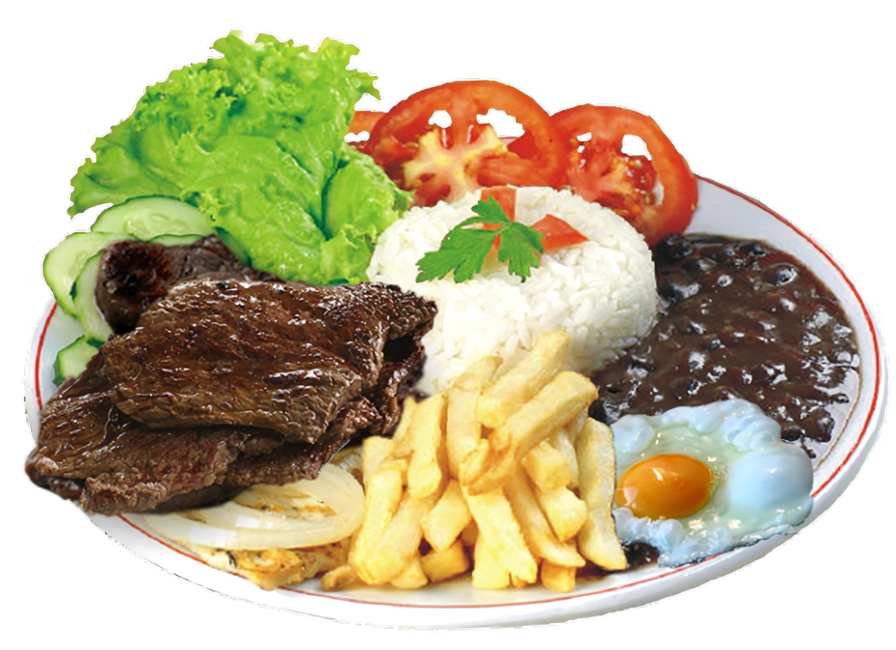

# 🍽️ Restaurant Website

A modern, responsive restaurant website built with HTML, CSS, and JavaScript. This project showcases a beautiful user interface for a restaurant, featuring an interactive menu, about section, services, and contact information.



## ✨ Features

- 📱 Fully responsive design for all devices
- 🎯 Interactive navigation menu
- 🔝 Back-to-top button functionality
- 📱 Mobile-friendly hamburger menu
- 🎨 Modern and attractive UI design
- 🖼️ Image gallery of dishes
- 📱 Mobile app download section

## 🛠️ Technologies Used

- HTML5
- CSS3
- JavaScript
- Font Awesome Icons

## 🚀 Getting Started

### Prerequisites

- A modern web browser
- Basic understanding of HTML, CSS, and JavaScript

### Installation

1. Clone the repository:
   ```bash
   git clone https://github.com/NobreJanio/Restaurante.git
   ```

2. Navigate to the project directory:
   ```bash
   cd restaurant-website
   ```

3. Open `index.html` in your preferred web browser.

## 📋 Project Structure

```
├── index.html          # Main HTML file
├── style.css          # CSS styles
├── image/             # Image assets
│   ├── 1.png
│   ├── 2.jpg
│   └── ...
└── README.md
```

## 🎯 Key Components

### 🏠 Home Section
- Hero section with restaurant introduction
- Call-to-action button
- Responsive navigation menu

### 📖 About Section
- Restaurant description
- High-quality food images
- Engaging content

### 🍽️ Services Section
- Featured restaurant services
- Iconic representations
- Service descriptions

### 📜 Menu Section
- Daily special dishes
- Pricing information
- Food images

### 📱 Contact Section
- Mobile app availability
- App store links
- Contact information

## 🎨 Design Features

- Orange and dark theme color scheme
- Modern typography
- Smooth scrolling
- Interactive elements
- Consistent spacing and layout

## 📱 Mobile Responsiveness

The website is fully responsive and provides an optimal viewing experience across a wide range of devices:
- Desktop computers
- Tablets
- Mobile phones

## 🤝 Contributing

Contributions are welcome! Feel free to:
1. Fork the project
2. Create your feature branch
3. Commit your changes
4. Push to the branch
5. Open a pull request

## 📄 License

This project is licensed under the MIT License - see the LICENSE file for details.

## 📞 Contact

For any questions or suggestions, please feel free to reach out:
- Website: [your-website.com]
- Email: [your-email@example.com]
- Phone: 99999-9999

---

⭐ Don't forget to star this repository if you found it helpful!